# 白泽 2.9.1 界面改进与渲染记录

这一轮调整覆盖首页、清理、自动计划、设置、记录、日志和专项工具详情。页面围绕“当前状态 → 主要操作 → 分类明细”重新组织，统一标题、留白、卡片、按钮与浅深色层次。

下图来自 **Robolectric 对实际 Android 页面布局的渲染**：主页面与多数详情使用真实 Compose 路由，白名单使用实际 XML 布局。它们不是设计稿，也不是手机实拍。数量、应用名称、文件路径和设备信息均为测试样例；各页面状态独立，不代表真实手机的扫描结果或清理效果。本页记录界面实现与检查范围，不表示版本已经发布。

## 首页：先处理当前任务

首页将服务状态与“开始扫描”放在第一张卡片中，安装包和文件归类作为常用入口，存储统计与自动清理计划顺序下移。主要操作会随连接状态、执行状态和扫描结果变化，避免让用户先在一组数字面板里寻找入口。

| 浅色 | 深色 |
| --- | --- |
|  | 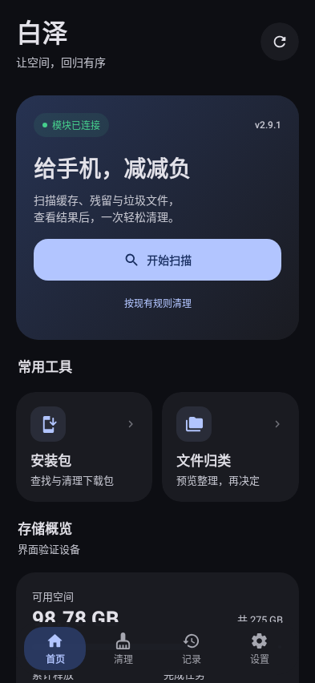 |

## 清理：工具与自动计划各自完整

清理页默认展示扫描入口和纵向排列的专项工具，包括安装包、应用缓存、卸载残留、深度清理，以及下方的文件归类和清理规则。顶部两个入口分别承载手动工具与自动计划，减少在多层标签之间寻找功能的过程。

自动计划中，每个类别的开关与执行间隔放在一起。安装包保留时间与安装包周期位于同一张卡片，并说明两个设置的区别：**周期决定多久检查一次，保留时间决定哪些安装包能自动删除**。周期可精确输入分钟；手动扫描不受后台保留天数限制。计划修改即时保存，后台任务仍遵守息屏、充电、电量等执行条件。

| 浅色 | 深色 |
| --- | --- |
| 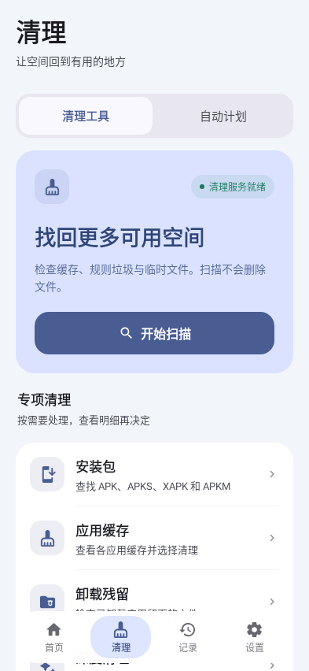 | 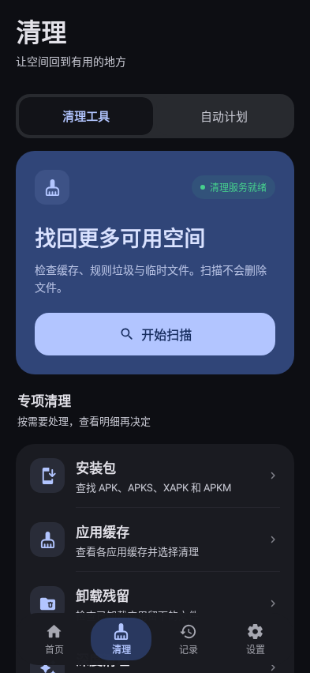 |

## 设置：先看摘要，需要时再展开

服务状态、外观、白名单和清理规则放在前面。后台清理条件、文件归类条件和通知先显示当前摘要，展开后再调整具体开关。电量和单文件大小上限通过数值对话框编辑。

运行设置保留明确的保存操作，并与即时生效的主题设置区分。外观页面也采用同一套组件，保留浅深色、壁纸取色、强调色、材质、导航栏与流畅度选项；选择项纵向排列，减少长标签在窄屏上的拥挤。

| 浅色 | 深色 |
| --- | --- |
| 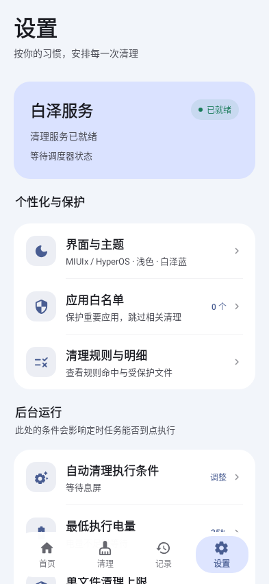 | 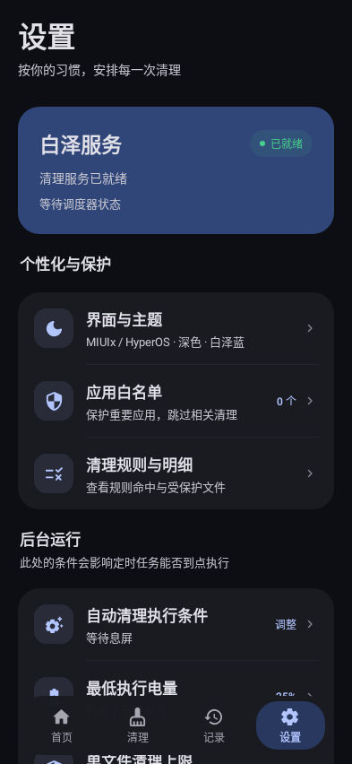 |

## 记录与日志：结果可追溯

记录页保留一个累计释放空间摘要，其他累计统计按需展开。下方通过“任务时间线”和“应用与文件”查看执行记录与分类结果；应用明细按列表项加载；历史记录取消前 50 条的显示限制。

日志页沿用相同的分组方式，将任务记录与原始输出分开。任务记录可筛选异常；原始输出支持选择复制和加载更早的内容，避免一次铺开全部长日志。

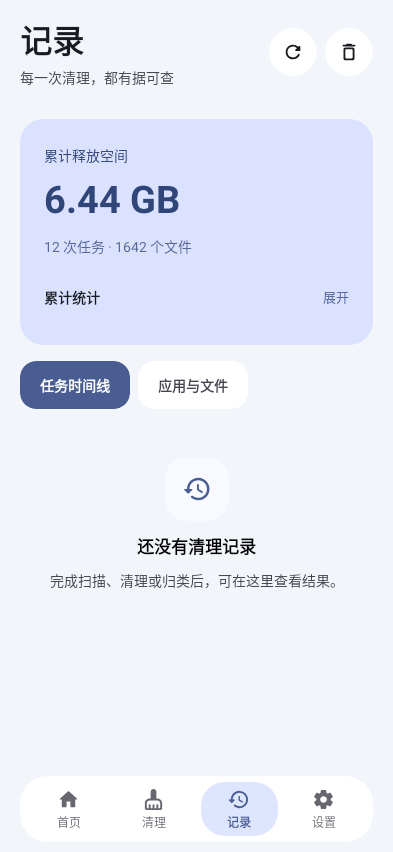

## 专项详情：扫描结果与下一步操作放在一起

安装包和缓存详情共用任务卡片：数量、大小、当前阶段与主要操作集中显示。扫描完成后可基于当前结果发起清理，“重新扫描”作为单独操作。明细继续显示文件或应用名称、大小与路径，便于核对清理对象。

| 安装包结果 | 缓存结果 · 深色 |
| --- | --- |
| 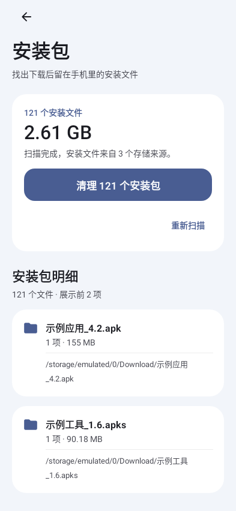 | 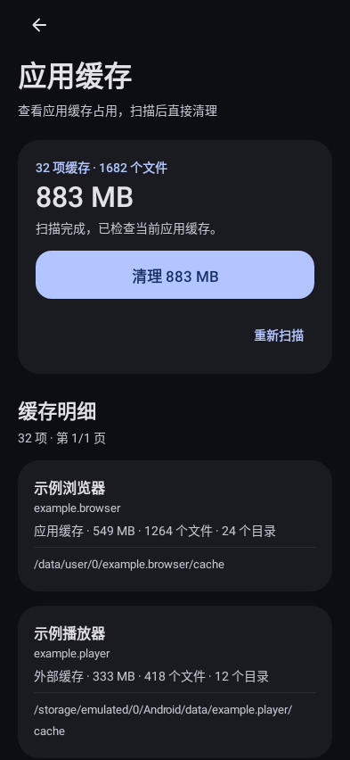 |

文件归类页集中呈现归类状态、目标位置、文件类型及撤销入口，后续设置继续向下排列。白名单页保留搜索、应用类型筛选、批量选择和保存操作，使用更清楚的列表与保护状态。

| 文件归类 | 应用白名单 |
| --- | --- |
| 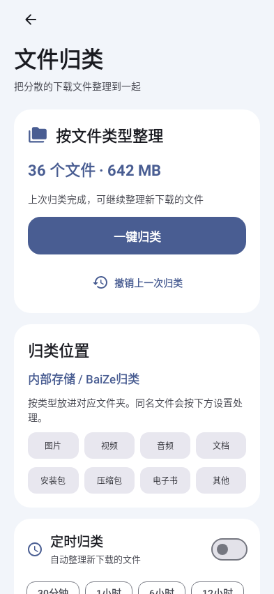 | 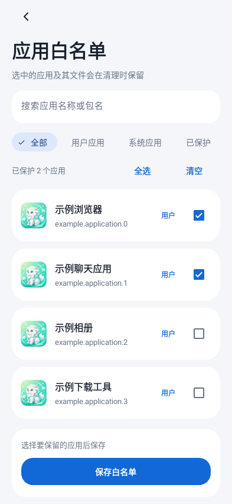 |

## 窄屏与大字号检查

标准截图使用 **393 × 852 dp** 的布局配置；下列三个页面另外使用 **320 × 740 dp、字体缩放 1.3 倍**渲染。检查重点是标题与按钮是否可读、长说明和路径能否换行，以及主要操作是否仍可使用。页面内容可以向下滚动，截图仅展示当前视口。

| 首页 | 清理 | 安装包详情 |
| --- | --- | --- |
| 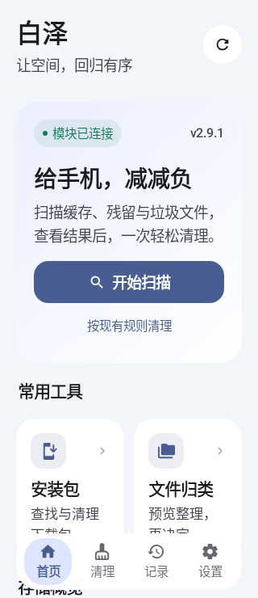 | 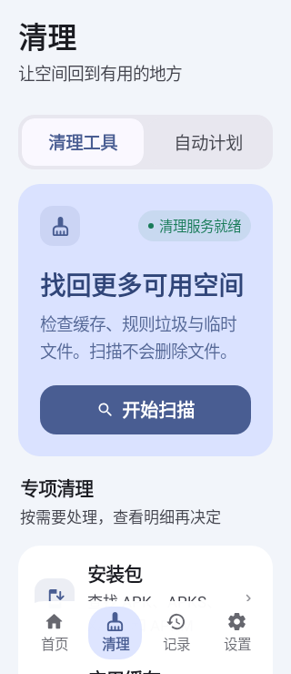 | 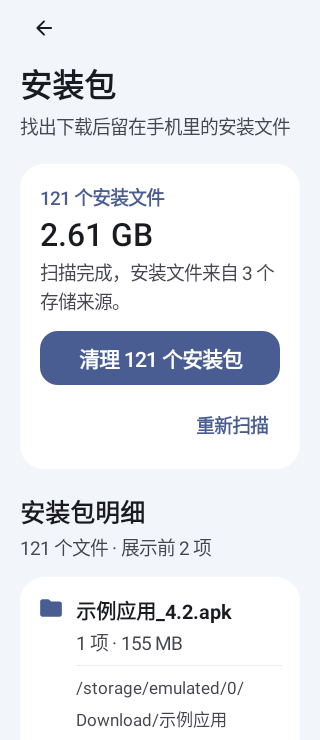 |

本页列出的浅深色配对覆盖首页、清理和设置，另含缓存详情深色状态；320 dp 与大字号截图覆盖首页、清理和安装包详情。它们用于检查本轮实际布局，没有覆盖所有屏幕尺寸、全部交互状态或真实设备的渲染差异。

渲染测试使用 Android API 35、中文配置和 Robolectric 原生图形模式，固定关闭壁纸取色、半透明材质与模糊以便比较。截图不用于证明真实设备上的模糊效果、滚动帧率、Root 授权或清理性能。

对应测试源码：[主页面渲染](../../../v2/app/src/testDebug/java/io/github/xgl34222220/baize/UiVisualReviewTest.kt)、[详情与白名单渲染](../../../v2/app/src/testDebug/java/io/github/xgl34222220/baize/DetailVisualReviewTest.kt)。
