# 白泽 2.9.2 界面重设计

本轮根据洛书现有原生界面的紧凑标题、分组列表与悬浮导航重排白泽。首页改用空间圆环与集中扫描操作，专项工具、自动计划、设置、记录、日志、主题和详情同步调整。

以下图片由 **Robolectric 渲染实际 Android 页面**，不是设计稿或手机实拍。数值、文件路径、应用名称和任务记录均为测试样例，各页面状态独立。页面可以滚动，图片展示当前视口。

## 首页前后对照

| 2.9.1 | 2.9.2 |
| --- | --- |
| 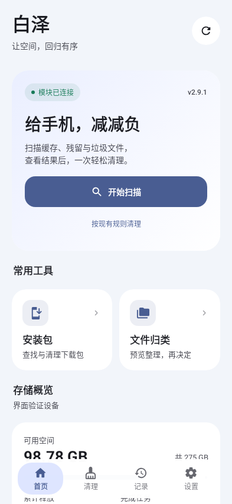 | 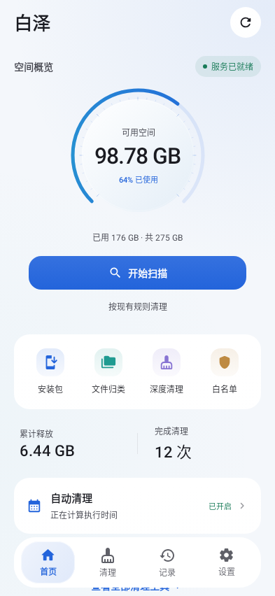 |

容量圆环显示实际可用空间与使用比例；扫描时转为真实进度或处理状态，完成后显示候选数量与大小。异常扫描不会显示为已清爽。首页仍先扫描再清理，已有候选通过当前快照执行；自动计划摘要直接打开清理页的自动计划。

## 清理与设置

| 清理工具 | 自动计划 | 设置 |
| --- | --- | --- |
| 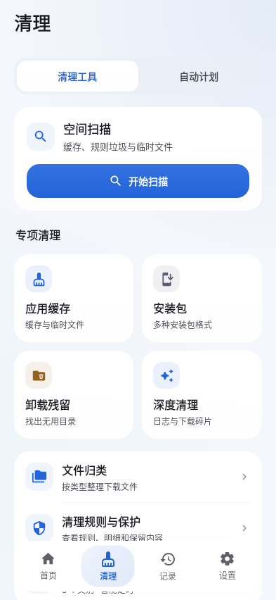 | 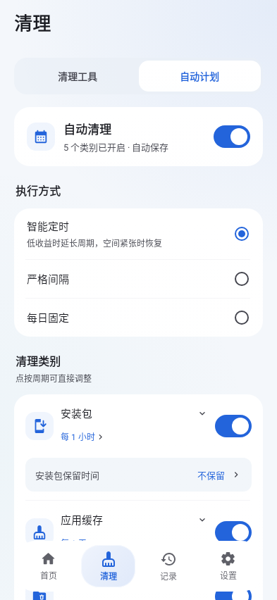 | 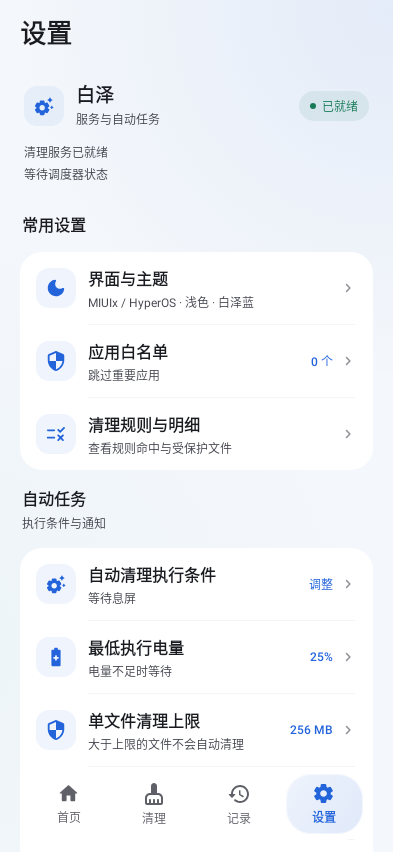 |

自动计划将类别、开关和周期放在同组。安装包保留期限单独显示，关闭自动安装包清理后仍能找到该设置。设置保留本地草稿及保存流程，后台状态刷新不会覆盖未保存的选项。

## 详情与辅助页面

| 安装包结果 | 文件归类 | 外观 |
| --- | --- | --- |
| 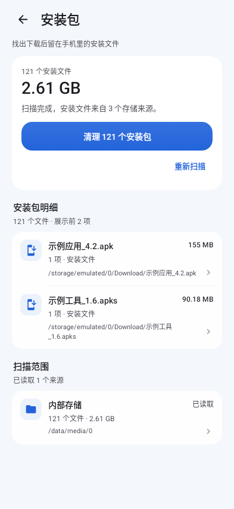 | 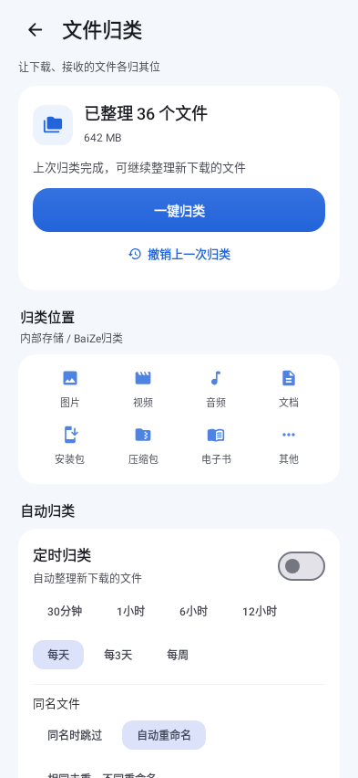 | 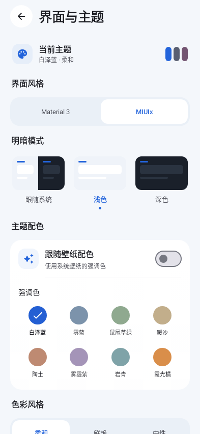 |

结果列表继续按需加载，点击文件或应用行可展开完整明细并选择复制。文件归类的周期和冲突策略改为换行布局，保留执行条件、撤销和冲突处理。主题页保留 Material 3、MIUIx、浅深色、壁纸取色、强调色、AMOLED、材质和流畅度设置。

| 记录 | 日志 | 白名单 |
| --- | --- | --- |
| 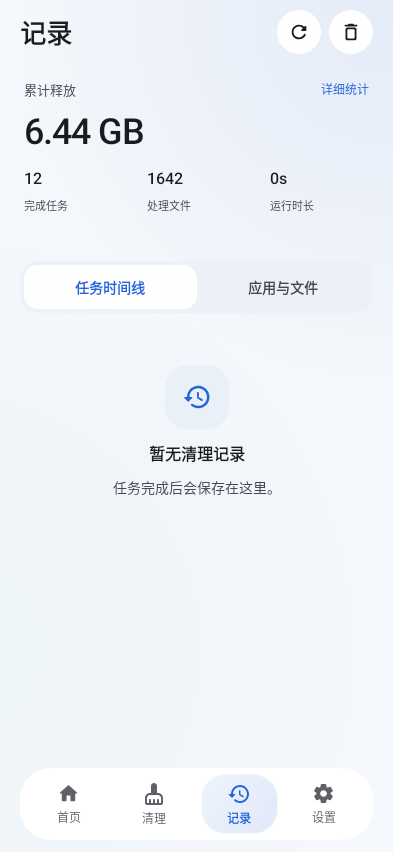 | 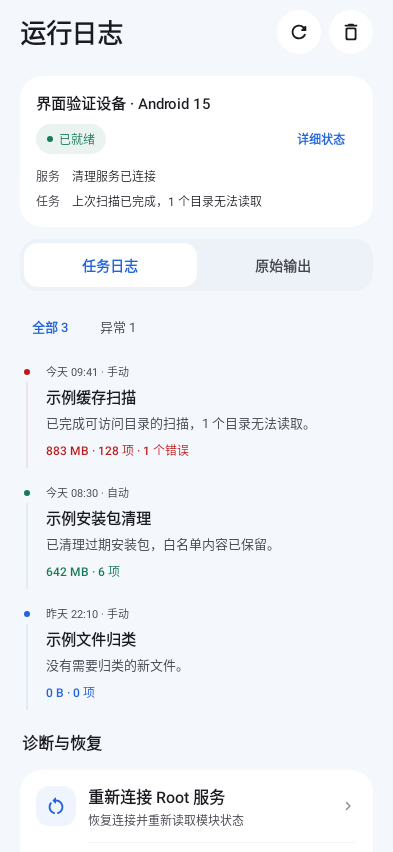 | 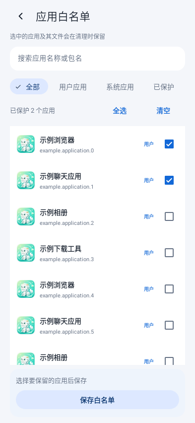 |

## 深色与小屏

| 首页深色 | 设置深色 | 320 dp、1.3 倍字号 |
| --- | --- | --- |
| 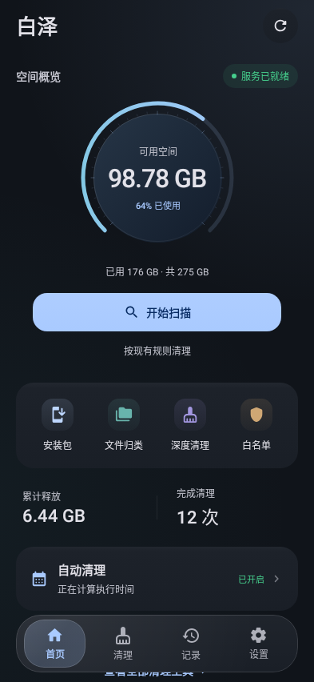 | 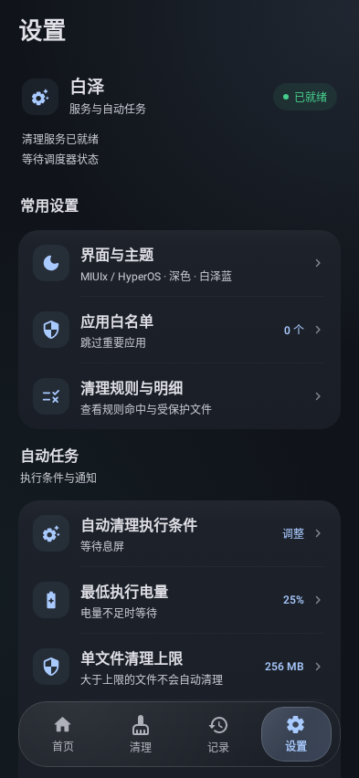 | 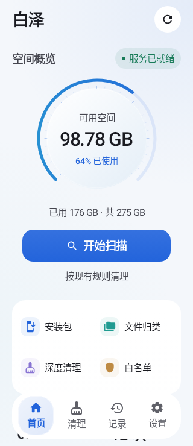 |

默认冷白背景和白泽蓝只作用于未定制的默认配色，用户保存的取色与主题选项继续生效。窄屏大字号的工具切换为两列；底栏触控区域随字号增加，内容为底栏保留滚动空间。

## 检查方式与边界

- 标准页面配置为 393 × 852 dp；小屏配置为 320 × 740 dp、1.3 倍字号，Android API 35、中文。
- 自动化交互检查覆盖首页先扫描、首页直达自动计划、安装包保留期限可见和明细弹窗。
- 主要截图打开玻璃材质、关闭背景模糊以检查清晰降级；额外渲染打开模糊的首页。软件绘制环境采用不透明底栏，避免底层文字透过。
- 浮动底栏在支持的硬件渲染环境使用 Haze 背景模糊与独立移动选中层；静态页面卡片没有背景采样或持续动画。
- 这些截图用于检查实际布局、文字与主题，不证明手机 GPU 上的模糊效果、滚动帧率、Root 权限或清理速度；本轮未连接真机。

测试源码：[主页面](../../../v2/app/src/testDebug/java/io/github/xgl34222220/baize/UiVisualReviewTest.kt)、[详情与白名单](../../../v2/app/src/testDebug/java/io/github/xgl34222220/baize/DetailVisualReviewTest.kt)、[日志与外观](../../../v2/app/src/testDebug/java/io/github/xgl34222220/baize/UtilityVisualReviewTest.kt)。
