# 白泽 2.9.3 实际页面检查

以下图片由 Robolectric 绘制当前 Android 页面，使用测试应用、文件和任务数据，不是设计稿或手机实拍。截图展示当前滚动位置，不代表全部列表内容。

## 扫描结果与选择

| 大量扫描结果 | 中高风险逐项选择 | 失败后保留记录 |
| --- | --- | --- |
| 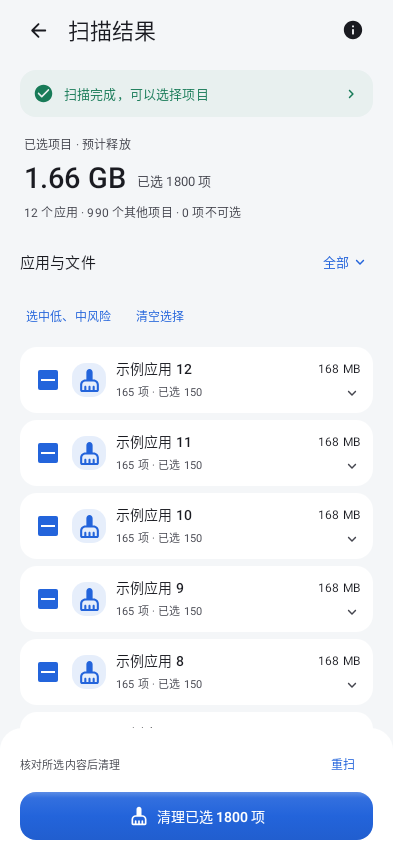 | 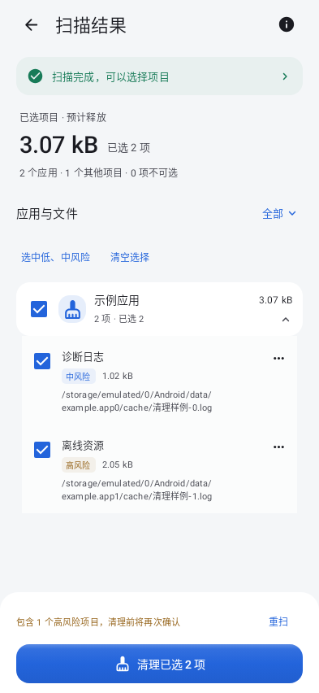 | 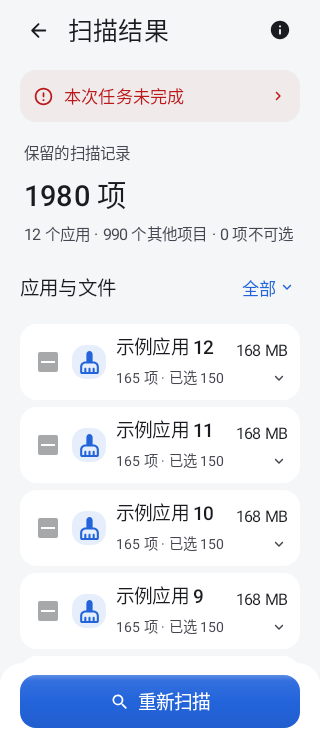 |

任务提示、所选容量、筛选和应用列表分开排列，默认折叠分组，底部始终保留主要操作。中风险允许逐项选择，高风险必须单独勾选并在对话框核对后提交；对话框确认链由交互测试验证，上图展示 Activity 中的选择状态。

失败后保留原列表和选择。若请求已经发出但结果无法确认，则按钮改为重新扫描；不把全部候选改成受保护，也不使用成功勾号表示失败。

## 规则、策略与清理工具

| 规则与保护 | 清理策略 | 即时缓存 |
| --- | --- | --- |
| 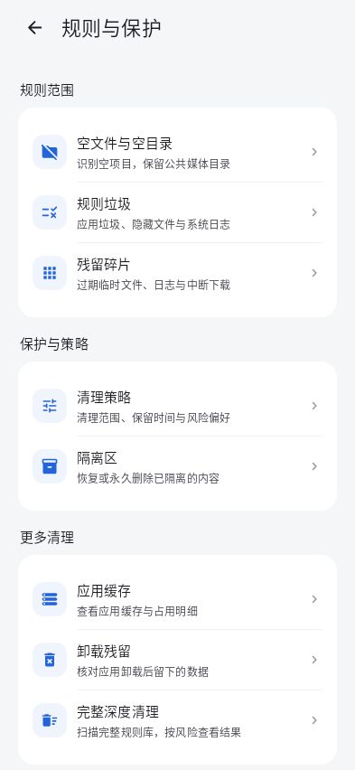 | 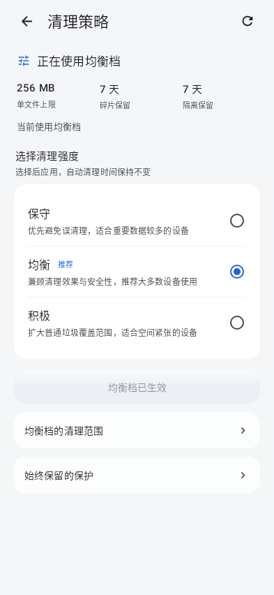 |  |

| 断点续清 | 受保护项目 | 隔离区 |
| --- | --- | --- |
| 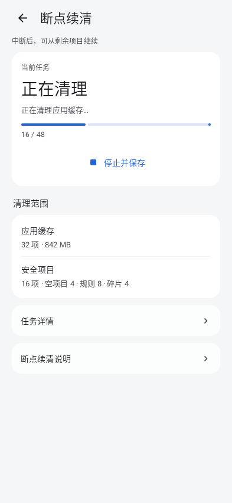 | 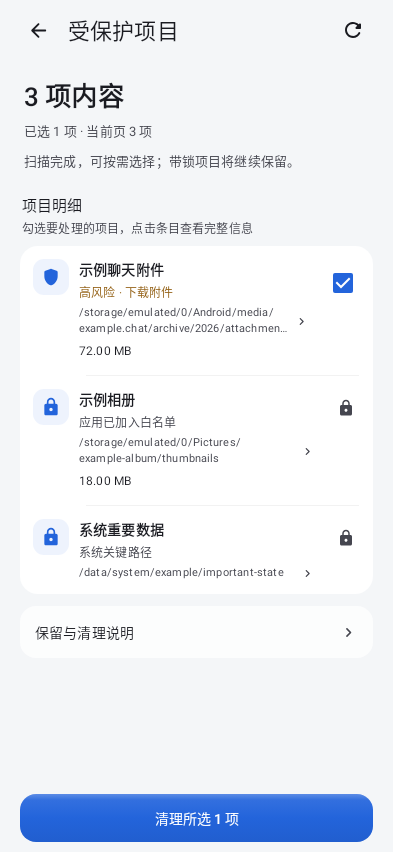 | 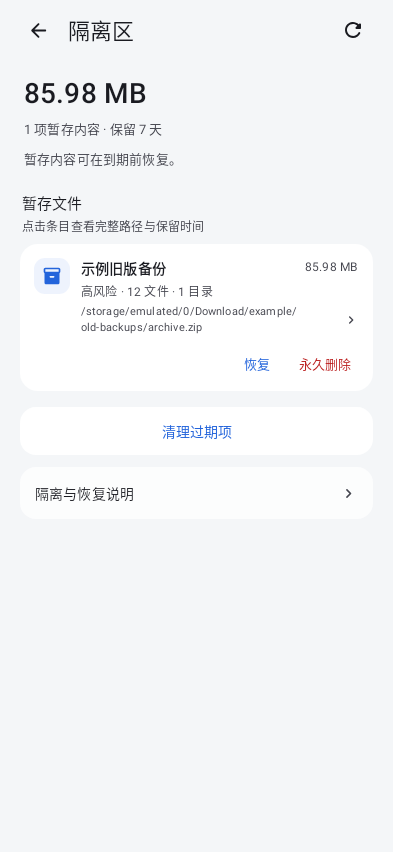 |

说明改为按需展开，结果采用连续列表。策略选择通过明确按钮应用；隔离恢复与永久删除保留各自确认和失败提示。

## 主页面与辅助页面

| 首页 | 清理 | 设置 |
| --- | --- | --- |
| 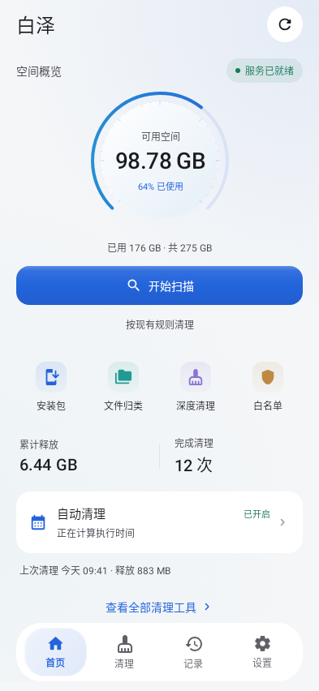 |  | 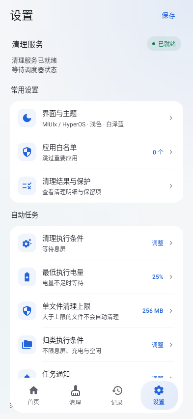 |

| 文件归类 | 白名单窄屏 | 日志 |
| --- | --- | --- |
| 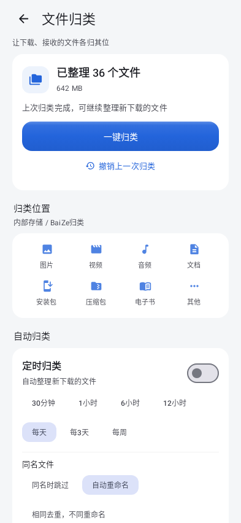 | 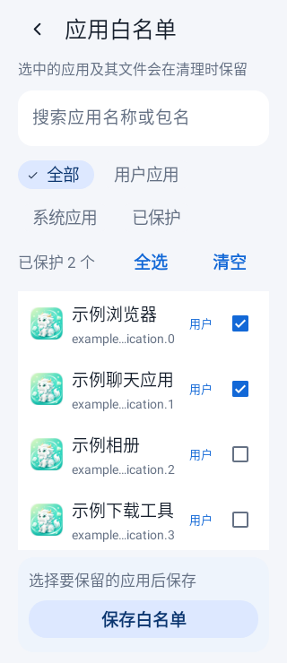 | 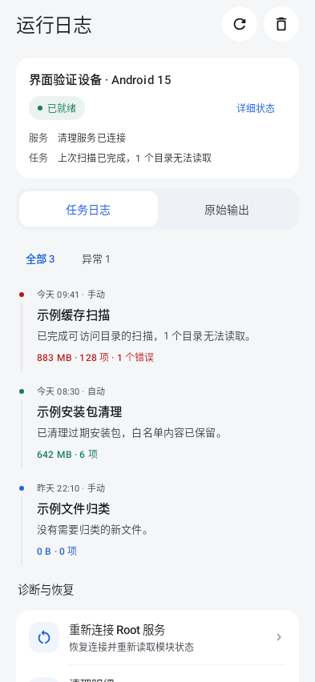 |

统一标题与正文字阶、按钮高度、图标容器、卡片圆角和间距。顶部保存取代设置页重复的底部保存按钮，白名单筛选在窄屏换行。主导航保留原有玻璃模糊能力，遮住导航下方无法操作的间隙，避免露出半行滚动文字。

## 深色与放大字体

| 深色扫描结果 | 深色首页 | 小屏首页 |
| --- | --- | --- |
| 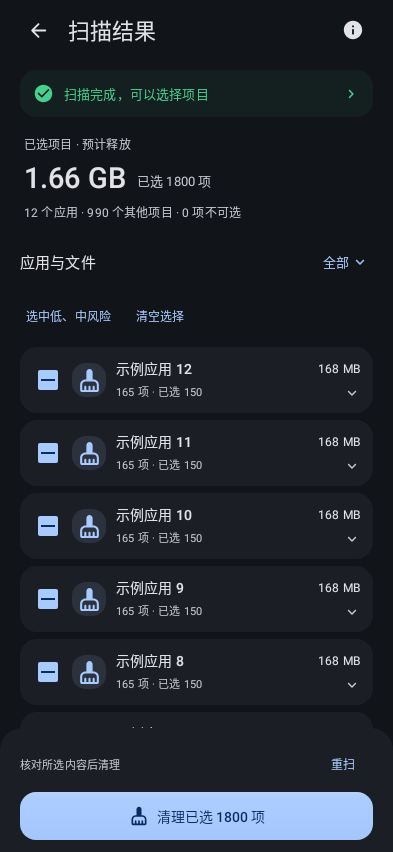 | 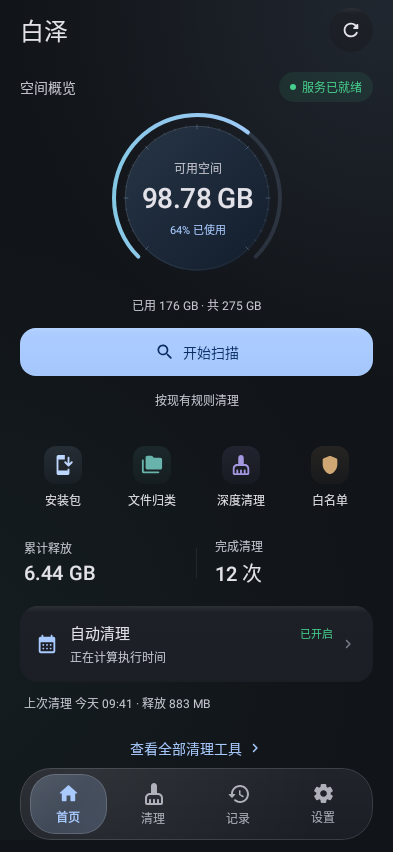 | 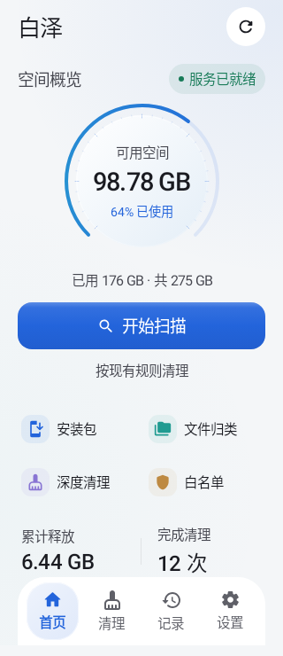 |

标准配置为 393 × 852 dp，小屏为 320 × 740 dp、1.3 倍字体；使用 Android API 35 中文配置。保留系统字体、已有主题、壁纸取色和 AMOLED 设置。

## 验证范围

- 页面测试覆盖浅深色、长标题、长路径、大量结果、错误状态、筛选和操作回调；高风险确认要求扫描快照与选择未发生变化。
- 文件传输回归覆盖 1,772 条 Unicode 路径及超过截图所示 429,480 字节的请求和响应，验证真实文件描述符读写与清理，不代表实机 Binder 压力测试。
- 规则测试使用真实规则格式和磁盘夹具，验证扫描命中、按项清理、保留期、白名单、别名与禁止路径；不使用可清理字节数作为“清理干净”的证明。
- 未连接手机评估 Root 兼容性、GPU 模糊效果、滚动帧率或实际扫描耗时。静态截图不证明这些指标。

测试源码位于 [testDebug](../../../v2/app/src/testDebug/java/io/github/xgl34222220/baize) 和 [Root 回归测试](../../../v2/app/src/test/java/io/github/xgl34222220/baize/root)。
